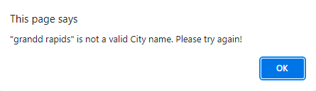

# Weather Dashboard
Weather Dashboard is a website that can show you the current and 5 day weather forecast for any city in the world.

## Description and Instructions
* The user can enter any city name into the search input and click the "Search" button (or hit the "Enter" key) to see the current weather conditions and 5 day forecast for that city.
* The current UV index background color will change based on its value: Green = UVI < 4; Yellow = 4 < UVI < 8; Red = UVI >8.
* Each city entered is automatically saved in localStorage and a button created for it, with a limit of 5 total cities. The oldest city searched will be removed whenever a 6th city is searched, and that 6th city will become the 5th, or most recent, city saved in localStorage and as a button. These buttons can be clicked to quickly reload that city's weather information.

* If an invalid city name is entered, an alert will inform the user to try again.

* The weather information is fetched from OpenWeather's API. The documentation on this API can be found at: https://openweathermap.org/api/one-call-api
* Link to deployed website: https://spaghettimedic.github.io/weatherDashboard/